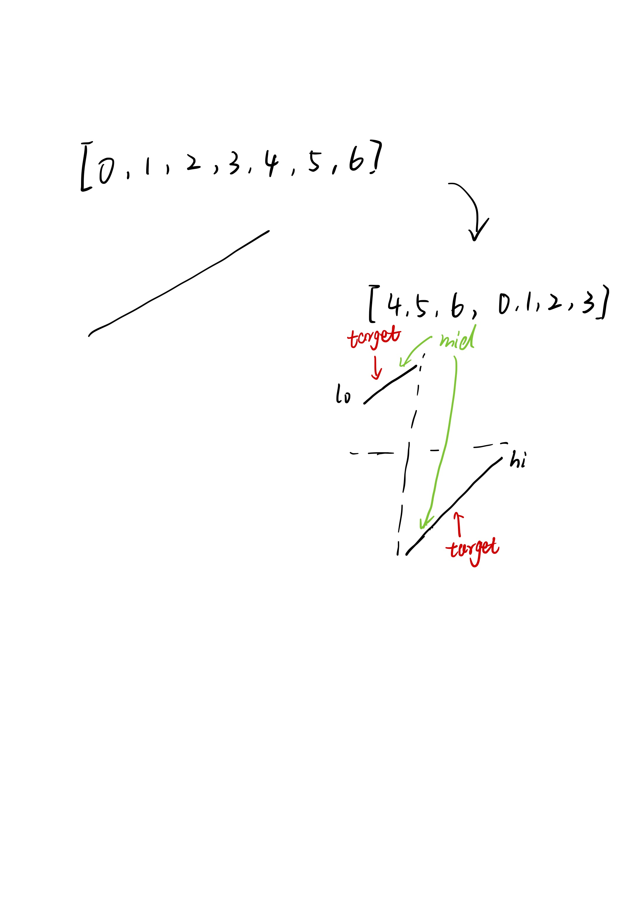
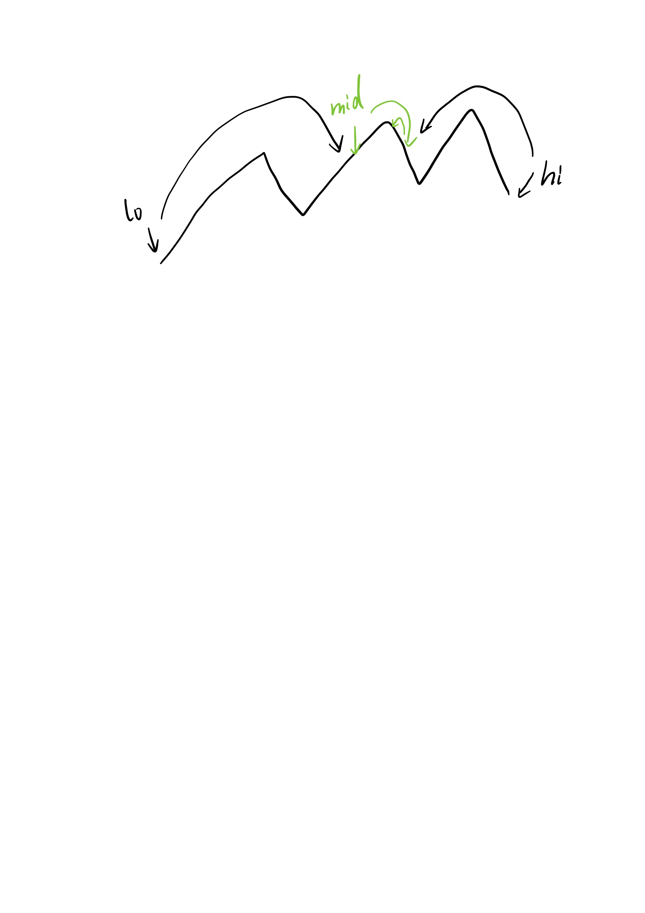

# Binary Search (rotate sorted array & find peak element)

## [33. Search in Rotated Sorted Array](https://leetcode.com/problems/search-in-rotated-sorted-array/)

the naive solution is `O(n)`, we focus on `O(logn)` solution.

go through a case:
[0, 1, 2, 3, 4, 5, 6] -> [4, 5, 6, 0, 1, 2, 3]

simply draw a picture of all situations:


```java
class Solution {
    public int search(int[] nums, int target) {
        int lo = 0, hi = nums.length - 1;
        while (lo <= hi) {
            int mid = lo + (hi - lo) / 2;
            if (nums[mid] == target) return mid;
            if (nums[mid] >= nums[lo]) { // mid in left sorted part
                if (target < nums[mid] && target >= nums[lo]) {
                    hi = mid - 1;
                } else {
                    lo = mid + 1;
                }
            } else if (nums[mid] <= nums[lo]) { // mid in right sorted part
                if (target > nums[mid] && target <= nums[hi]) {
                    lo = mid + 1;
                } else {
                    hi = mid - 1;
                }
            }
        }
        return -1;
    }
}
```

**follow up:** `nums` in cluding duplicate elements.

the worest case is `O(n)`, we need to add `lo++` or `hi--` in the end.

## [81. Search in Rotated Sorted Array II](https://leetcode.com/problems/search-in-rotated-sorted-array-ii/)

```java
class Solution {
    public boolean search(int[] nums, int target) {
        int lo = 0, hi = nums.length - 1;
        while (lo <= hi) {
            int mid = lo + (hi - lo) / 2;
            if (nums[mid] == target) return true;
            if (nums[mid] > nums[lo]) {
                if (target < nums[mid] && target >= nums[lo]) {
                    hi = mid - 1;
                } else {
                    lo = mid + 1;
                }
            } else if (nums[mid] < nums[lo]) {
                if (target <= nums[hi] && target > nums[mid]) {
                    lo = mid + 1;
                } else {
                    hi = mid - 1;
                }
            } else {
                lo++;
            }
        }
        return false;
    }
}
```

## [153. Find Minimum in Rotated Sorted Array](https://leetcode.com/problems/find-minimum-in-rotated-sorted-array/)

```java
class Solution {
    public int findMin(int[] nums) {
        int lo = 0, hi = nums.length - 1;
        int min = Integer.MAX_VALUE;
        while (lo < hi) {
            int mid = lo + (hi - lo) / 2;
            if (nums[lo] < nums[hi]) {
                return nums[lo];
            }
            if (nums[mid] >= nums[lo]) {
                lo = mid + 1;
            } else {
                hi = mid;
            }
        }
        return nums[lo];
    }
}
```

**tips:** You use `while (start <= end)` if you are returning the match from inside the loop.

You use while `(start < end)` if you want to exit out of the loop first, and then use the result of start or end to return the match.

## [162. Find Peak Element](https://leetcode.com/problems/find-peak-element/)

since it's guaranteed to have a output, we just need to narrow down the range to get onr of peaks.



```java
class Solution {
    public int findPeakElement(int[] nums) {
        int lo = 0, hi = nums.length - 1;
        while (lo < hi) {
            int mid = lo + (hi - lo) / 2;
            if (nums[mid] < nums[mid + 1]) { // move to right side
                lo = mid + 1;
            } else if (nums[mid] > nums[mid + 1]) {
                hi = mid;
            }
        }
        return lo;
    }
}
```

same code can be used to solve [852. Peak Index in a Mountain Array](https://leetcode.com/problems/peak-index-in-a-mountain-array/)
